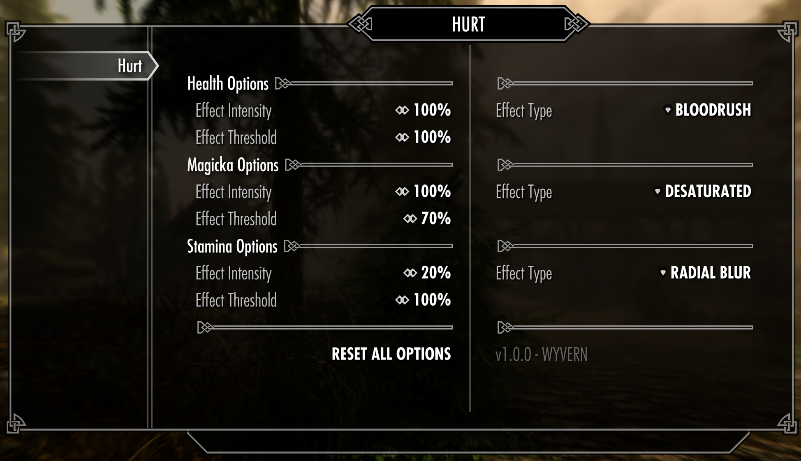
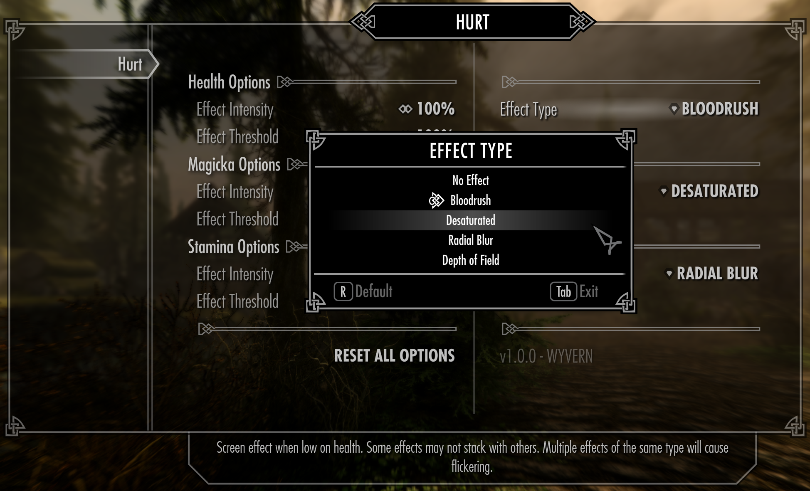

# 🩸 Hurt - Immersive Attributes

Want a more immersive experience? Is it not obvious enough when on low health?
Well look no further! Hurt is a mod centred around making you *feel* that low
health or stamina bar, with screenspace effects to provide an immersive experience.

Hurt also aims to be configurable, with a fully featured MCM menu and plenty of
options. Only want the health effects? Easily done.

Inspired by [ApolloDown's Important Information Overhaul for Skyrim LE](https://www.nexusmods.com/skyrim/mods/52471)

## MCM Menu

The provided MCM menu contains fully annotated options, along with a setting
reset button.

## Effects

Currently supported effects are:

- Bloodshot effect
	- Dark-red tint effect
- Desaturated
	- Turn the screen black and white
- Radial Blur
	- Blur the screen equally
- Depth of field
	- Blur distant objects

Most effects stack, and can be used for any attribute (Health, Magicka, Stamina)

**Caution: Two effects of the same type will cause flickering**

## Supported Languages

- English

*(Always open to translations)*

## Contributing

See [Contributing.md](Contributing.md)
